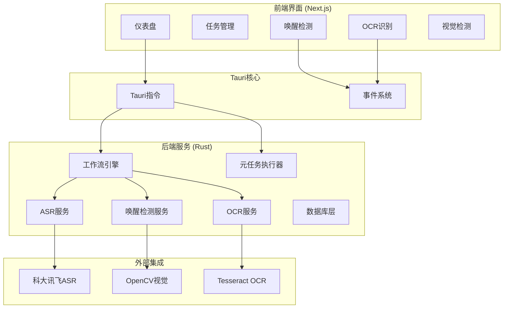

# 车机语音LLM自动化评估系统

一个基于 **Tauri** 和 **Next.js** 构建的桌面自动化测试应用，专注于车载语音助手的唤醒检测、语音识别和响应质量评估。

## 核心功能

- **任务管理**: 创建、配置和执行完整的测试任务，支持批量自动化测试
- **唤醒检测**: 视觉唤醒词检测（基于OpenCV模板匹配）和音频唤醒测试
- **语音识别**: 集成科大讯飞ASR API进行实时语音识别
- **OCR识别**: 车机显示屏文本识别和稳定性检测
- **大模型分析**: 基于LLM的响应质量评估
- **实时工作流**: 支持暂停/恢复的自动化测试流程
- **模板管理**: 可视化模板管理，支持ROI区域选择
- **本地数据持久化**: SQLite数据库存储所有测试数据

## 技术栈

### 前端
- **框架**: Next.js 15.2.4 (App Router)
- **UI**: Shadcn UI, Radix UI, Tailwind CSS
- **状态管理**: Redux Toolkit
- **路由**: `/llm-analysis`, `/taskmanage`, `/casemanage`, `/settings`, `/wake-detection-workflow`

### 后端
- **框架**: Tauri v2 + Rust
- **异步运行时**: Tokio
- **数据库**: SQLite + SQLx
- **音频**: Rodio播放, CPAL音频捕获
- **OCR**: Tesseract引擎池（6并发）
- **视觉**: OpenCV模板匹配
- **ASR**: 科大讯飞WebSocket API

### 系统架构



## 工作流系统

### 完整测试工作流
```
唤醒词播放 → 语音指令播放 → 视觉唤醒检测 → OCR识别 → ASR识别 → LLM分析 → 结果保存
```

### 唤醒检测工作流
```
唤醒词播放 → 视觉唤醒检测 → 结果统计
```

### 核心组件
- **工作流引擎**: DAG任务调度，支持暂停/恢复
- **视觉唤醒检测**: OpenCV多尺度模板匹配，ROI区域支持
- **OCR服务**: 实时文本识别，稳定性检测，6引擎并发
- **ASR服务**: 科大讯飞实时语音识别

## 快速开始

### 环境要求
- **Node.js**: v18+
- **Rust**: v1.77+ (with Cargo)
- **Tauri CLI**: `cargo install tauri-cli`
- **macOS**: 需要音频录制和文件系统权限

### 安装与运行

1. **克隆仓库**
    ```bash
    git clone [仓库地址]
    cd [仓库目录]
    ```

2. **安装依赖**
    ```bash
    npm install
    ```

3. **启动开发环境**
    ```bash
    # 完整开发环境（推荐）
    npm run tauri dev
    
    # 仅前端开发
    npm run dev
    ```

4. **构建生产版本**
    ```bash
    npm run tauri build
    ```

## 项目结构

```
/LLM Analysis Interface
├── app/                          # Next.js页面路由
├── components/                   # React组件
│   ├── llm-analysis-interface.tsx
│   ├── wake-detection-workflow.tsx
│   ├── ocr.tsx
│   ├── visual-wake-detection.tsx
│   └── template-manager.tsx
├── hooks/                        # 自定义Hooks
├── services/                     # Tauri API封装
├── store/                        # Redux状态管理
├── public/templates/             # 视觉检测模板
└── src-tauri/                    # Tauri后端
    ├── src/
    │   ├── commands.rs          # Tauri指令定义
    │   ├── models.rs            # 数据模型
    │   ├── services/
    │   │   ├── meta_task_executor.rs    # 完整工作流
    │   │   ├── wake_detection_meta_executor.rs  # 唤醒检测工作流
    │   │   ├── analysis_task.rs         # 分析任务
    │   │   ├── asr_task.rs              # ASR任务
    │   │   ├── ocr_task.rs              # OCR任务
    │   │   └── checkpoint_task.rs       # 检查点任务
    │   └── db/database.rs       # 数据库操作
```

## 核心功能详解

### 视觉唤醒检测
- **实时视频**: WebRTC摄像头访问，1-30 FPS可调
- **模板匹配**: 多尺度匹配（1.0, 0.8, 0.6, 0.4, 0.3, 0.2）
- **ROI选择**: 交互式画布区域选择
- **置信度**: 可配置的检测阈值（默认0.5）

### OCR识别系统
- **实时处理**: 6个Tesseract引擎并发处理
- **文本稳定**: 30帧滑动窗口，95%相似度阈值
- **坐标转换**: 显示坐标到视频坐标的自动转换
- **错误处理**: 5次连续错误自动终止

### 事件系统
- **视觉检测**: `visual_wake_event`, `visual_wake_status`
- **OCR**: `ocr_task_event` (start, ready, data, complete, error)
- **工作流**: `task_completed`

## Tauri核心指令

### 任务管理
- `get_all_tasks`: 获取所有测试任务
- `create_task`: 创建新任务
- `delete_task`: 删除任务
- `set_current_task`: 设置当前任务
- `start_automated_test`: 启动自动化测试
- `stop_testing`: 停止测试

### 样本管理
- `get_all_samples`: 获取测试样本
- `create_sample`: 创建样本
- `delete_sample`: 删除样本
- `get_all_wake_words`: 获取唤醒词

### 视觉检测
- `start_visual_wake_detection_with_data`: 启动视觉检测
- `push_video_frame_visual`: 推送视频帧
- `stop_visual_wake_detection`: 停止检测
- `save_template_image`: 保存模板
- `get_templates_from_folder`: 获取模板列表

### OCR系统
- `start_ocr_session`: 启动OCR会话
- `push_video_frame`: 推送OCR帧
- `stop_ocr_session`: 停止OCR会话

## 开发脚本

```bash
# 开发环境
npm run tauri dev          # 完整开发环境
npm run dev               # 仅前端开发

# 构建
npm run build             # 构建Next.js
npm run tauri build       # 构建Tauri应用

# 代码质量
npm run lint              # ESLint检查
npm run start             # 生产服务器
```

## 数据模型

### 核心实体
- **Task**: 测试任务配置
- **Sample**: 测试样本（文本/音频）
- **WakeWord**: 唤醒词配置
- **AnalysisResult**: 分析结果
- **WakeDetectionResult**: 唤醒检测结果
- **TimingData**: 精确时间数据

## 性能优化

- **并发处理**: OCR 6引擎并发，视觉检测实时处理
- **内存管理**: 100帧缓冲区，自动垃圾回收
- **错误恢复**: 自动重试和优雅降级
- **资源清理**: 任务完成自动释放资源

## 打包部署注意事项

### 平台差异

#### Windows平台
- **OpenCV**: 使用静态链接，无需额外安装OpenCV运行时
- **Tesseract**: 静态链接tesseract库，打包时自动包含
- **依赖**: 所有依赖静态链接到可执行文件中
- **大小**: 由于静态链接，最终包体积较大（约100-200MB）

#### macOS平台
- **OpenCV**: 使用系统动态链接，依赖系统安装的OpenCV
- **Tesseract**: 使用系统动态链接，需要安装tesseract
- **安装要求**: 
  ```bash
  # 安装依赖
  brew install opencv
  brew install tesseract
  ```
- **包大小**: 由于动态链接，包体积相对较小（约50-80MB）

### 打包配置

#### Windows打包（动态链接打包）（静态链接打包看文档后续）

```bash
#先配置vcpkg,libclang等关键路径

$env:VCPKG_ROOT = "D:\Code\Auto-Evalution-App\depends\vcpkg-master"
配置libclang环境变量
$env:LIBCLANG_PATH = "D:\Code\Auto-Evalution-App\depends\clang+llvm-18.1.8-x86_64-pc-windows-msvc\bin"
Opencv需要Clang二进制文件来生成绑定，需要将clang的bin目录添加到PATH中
$env:PATH += "D:\Code\Auto-Evalution-App\depends\clang+llvm-18.1.8-x86_64-pc-windows-msvc\bin"
npm run tauri build
```

#### macOS打包

```bash
# 确保系统已安装依赖
brew install opencv tesseract

# 打包
npm run tauri build
```

### 权限配置

#### macOS权限
在`src-tauri/tauri.conf.json`中配置权限：
```json
{
  "macOS": {
    "entitlements": "entitlements.plist"
  }
}
```

创建`src-tauri/entitlements.plist`：
```xml
<?xml version="1.0" encoding="UTF-8"?>
<!DOCTYPE plist PUBLIC "-//Apple//DTD PLIST 1.0//EN" "http://www.apple.com/DTDs/PropertyList-1.0.dtd">
<plist version="1.0">
<dict>
    <key>com.apple.security.device.camera</key>
    <true/>
    <key>com.apple.security.device.audio-input</key>
    <true/>
    <key>com.apple.security.files.user-selected.read-write</key>
    <true/>
</dict>
</plist>
```

### 常见问题

#### Windows
1. **MSVC工具链**: 确保安装Visual Studio Build Tools
2. **OpenCV版本**: 使用vcpkg或预编译静态库
3. **运行时错误**: 检查Visual C++ Redistributable

#### macOS
1. **摄像头权限**: 需要在系统偏好设置中授予权限
2. **音频权限**: 首次运行时会提示麦克风权限
3. **OpenCV路径**: 确保`/usr/local/lib/libopencv*.dylib`存在
4. **Tesseract路径**: 确保`/usr/local/bin/tesseract`可访问

### 调试工具
- **控制台日志**: 查看详细操作信息
- **事件监控**: 监听Tauri事件状态
- **性能监控**: OCR FPS和错误率实时显示
- **权限检查**: 
  ```bash
  # macOS检查权限
  tccutil reset Camera
  tccutil reset Microphone
  ```

## Windows平台静态链接OpenCV打包指南

### 概述

在Windows平台下，为了生成一个无需额外安装OpenCV运行时的独立exe应用，我们需要将OpenCV静态链接到程序中。本指南详细说明了如何使用vcpkg下载OpenCV预编译版本，并通过配置Cargo.toml和批处理脚本来实现静态链接打包。

### 准备工作

#### 1. 安装必要工具
- **Visual Studio 2022**: 安装时选择"使用C++的桌面开发"工作负载
- **Git**: 用于克隆vcpkg仓库
- **Rust**: 确保使用MSVC工具链
- **Node.js**: v18+

#### 2. 下载和安装vcpkg
```bash
# 克隆vcpkg仓库（建议放在固定位置）
git clone https://github.com/microsoft/vcpkg.git D:\vcpkg

# 进入vcpkg目录
cd D:\vcpkg

# 运行bootstrap脚本
.\bootstrap-vcpkg.bat
```

#### 3. 使用vcpkg安装OpenCV静态库
```bash
# 安装OpenCV静态链接版本（x64）
.\vcpkg install opencv[core,imgproc,imgcodecs]:x64-windows-static

# 验证安装
.\vcpkg list opencv
```

### 步骤一：配置Cargo.toml

在`src-tauri`目录下创建`Windows-Cargo.toml`文件，包含以下内容：

```toml
[package]
name = "app"
version = "0.1.0"
description = "A Tauri App"
authors = ["your-name"]
license = ""
repository = ""
edition = "2021"
rust-version = "1.77.2"

[lib]
name = "app_lib"
crate-type = ["staticlib", "cdylib", "rlib"]

[build-dependencies]
tauri-build = { version = "2.3.1", features = [] }

[dependencies]
# ... 其他依赖保持不变 ...
opencv = { version = "0.95.0", features = ["clang-runtime", "imgproc", "imgcodecs"], default-features = false }
# ... 其他依赖保持不变 ...
```

**关键配置说明**：
- `opencv`依赖启用了`clang-runtime`特性，这允许OpenCV在编译时动态生成绑定
- `default-features = false`禁用了默认特性，避免不必要的依赖
- 特性`imgproc`和`imgcodecs`分别提供图像处理和图像编解码功能

### 步骤二：安装libclang

OpenCV的Rust绑定需要libclang来生成绑定代码。以下是安装方法：

#### 方法1：使用LLVM官方安装包
1. 访问 [LLVM下载页面](https://releases.llvm.org/download.html)
2. 下载最新版本的Windows预编译二进制文件（如`clang+llvm-18.1.8-x86_64-pc-windows-msvc.exe`）
3. 安装到固定路径（如`D:\llvm`）

#### 方法2：使用vcpkg安装
```bash
# 使用vcpkg安装LLVM
.\vcpkg install llvm:x64-windows-static
```

### 步骤三：运行Windows构建脚本

在`src-tauri`目录下使用`windows-build.bat`文件：注意查看vcpkg在该电脑上的位置并对bat中相应的路径进行替换

### windows-build.bat脚本详解

以下是批处理文件中每个命令的详细说明：

```batch
@echo off
REM 关闭命令回显，使输出更清晰

echo Setting up environment variables...
REM 显示提示信息

set VCPKG_ROOT=D:\vcpkg
REM 设置vcpkg根目录路径，需要根据实际安装位置修改

set VCPKGRS_DYNAMIC=0
REM 告诉vcpkg-rs使用静态链接而不是动态链接

set OPENCV_MSVC_CRT=static
REM 指定OpenCV使用静态链接的C运行时库

set VCPKGRS_TRIPLET=x64-windows-static
REM 设置vcpkg的目标三元组，表示x64架构的Windows静态链接版本

set OPENCV_LINK_PATH=%VCPKG_ROOT%\installed\x64-windows-static\lib
REM 设置OpenCV库文件路径，vcpkg安装的静态库位置

set OPENCV_INCLUDE_PATH=%VCPKG_ROOT%\installed\x64-windows-static\include
REM 设置OpenCV头文件路径

set OPENCV_LINK_LIBS=opencv_core4,opencv_imgproc4,opencv_imgcodecs4
REM 指定需要链接的OpenCV库模块

set LIBCLANG_PATH=D:\llvm\bin
REM 设置libclang的路径，用于OpenCV绑定生成

set PATH=%LIBCLANG_PATH%;%PATH%
REM 将libclang添加到PATH环境变量最前面

set LIBCLANG_STATIC=1
REM 告诉系统使用静态链接的libclang

set LIBCLANG_DISABLE_CRASH_RECOVERY=1
REM 禁用libclang的崩溃恢复，提高稳定性

if exist "%LIBCLANG_PATH%\libclang.dll" (
    echo libclang.dll found at %LIBCLANG_PATH%\libclang.dll
) else (
    echo ERROR: libclang.dll not found
    pause
    exit /b 1
)
REM 检查libclang.dll是否存在，不存在则退出

cargo clean
REM 清理之前的构建文件，确保全新构建

cargo build --release
REM 使用release模式构建Rust代码，启用优化

npm run tauri build
REM 执行Tauri构建流程，生成最终的exe文件

pause
REM 暂停脚本执行，等待用户按任意键关闭窗口
```

### 步骤四：运行构建脚本

这一步的含义是让Opencv进行选择性，仅编译当前代码中有使用到的["clang-runtime", "imgproc", "imgcodecs" 这几的功能，而不是编译这个Opencv库（注意一定需要做替换，不然可能因为OPENCV_LINK_LIBS环境变量没有配置更多功能的lib文件而导致报错编译失败）

1. **复制Cargo.toml**
   
   ```bash
   copy src-tauri\Cargo.toml src-tauri\Cargo.toml.backup
   copy src-tauri\Windows-Cargo.toml src-tauri\Cargo.toml
   
   或者直接将Cargo.toml中的
   opencv = { version = "0.95.0", features = ["clang-runtime"] }
   替换成
   opencv = { version = "0.95.0", features = ["clang-runtime", "imgproc", "imgcodecs"], default-features = false }
   ```
   
2. **执行构建**
   
   ```bash
   cd src-tauri
   .\windows-build.bat
   ```
   
3. **恢复原始Cargo.toml**
   ```bash
   copy src-tauri\Cargo.toml.backup src-tauri\Cargo.toml
   ```

### 处理不同的OpenCV安装位置

如果你的OpenCV安装在不同的位置，需要修改以下环境变量：

#### 情况1：使用官方OpenCV预编译包
如果从OpenCV官网下载的预编译包：
```batch
set OPENCV_DIR=C:\opencv\build
set OPENCV_LINK_PATH=%OPENCV_DIR%\x64\vc15\staticlib
set OPENCV_INCLUDE_PATH=%OPENCV_DIR%\include
```

#### 情况2：使用Conda安装的OpenCV
如果使用Anaconda安装的OpenCV：
```batch
set CONDA_ENV=C:\Users\YourName\anaconda3\envs\opencv
set OPENCV_LINK_PATH=%CONDA_ENV%\Library\lib
set OPENCV_INCLUDE_PATH=%CONDA_ENV%\Library\include
```

#### 情况3：自定义安装路径
创建一个配置文件`config.bat`来管理路径：
```batch
@echo off
REM config.bat - 用户自定义路径配置

REM 设置vcpkg路径
set VCPKG_ROOT=D:\dev\vcpkg

REM 设置LLVM路径
set LIBCLANG_PATH=D:\dev\llvm\bin

REM 设置OpenCV路径（如果使用其他安装方式）
set OPENCV_CUSTOM_DIR=C:\libs\opencv
set OPENCV_LINK_PATH=%OPENCV_CUSTOM_DIR%\lib
set OPENCV_INCLUDE_PATH=%OPENCV_CUSTOM_DIR%\include
```

然后在`windows-build.bat`开头调用：
```batch
call config.bat
```

### 常见问题排查

#### 1. 找不到libclang.dll
**错误信息**：

```bash
thread 'main' panicked at C:\Users\zhang\.cargo\registry\src\index.crates.io-1949cf8c6b5b557f\bindgen-0.64.0\lib.rs:2393:31:
  Unable to find libclang: "couldn't find any valid shared libraries matching: ['clang.dll', 'libclang.dll'], set the `LIBCLANG_PATH` environment variable to a path where one of these files can be found (invalid: [])"
```

完整错误信息：

```bash
error: failed to run custom build command for `leptonica-sys v0.4.9`

Caused by:
  process didn't exit successfully: `D:\Code\Auto-Evaluate-App-main\src-tauri\target\debug\build\leptonica-sys-a48b323830cb2656\build-script-build` (exit code: 101)
  --- stdout
  cargo:rerun-if-env-changed=LEPTONICA_INCLUDE_PATH
  cargo:rerun-if-env-changed=LEPTONICA_LINK_PATHS
  cargo:rerun-if-env-changed=LEPTONICA_LINK_LIBS
  cargo:warning=vcpkg gave up trying to resolve pkg-config ordering.
  cargo:rustc-link-search=native=D:\Code\Auto-Evaluate-App\depends\vcpkg-master\installed\x64-windows-static-md\lib
  cargo:rustc-link-lib=leptonica-1.85.0
  cargo:rustc-link-lib=zlib
  cargo:rustc-link-lib=tiff
  cargo:rustc-link-lib=lzma
  cargo:rustc-link-lib=jpeg
  cargo:rustc-link-lib=turbojpeg
  cargo:rustc-link-lib=openjp2
  cargo:rustc-link-lib=libwebpdecoder
  cargo:rustc-link-lib=libwebpdemux
  cargo:rustc-link-lib=libwebpmux
  cargo:rustc-link-lib=libwebp
  cargo:rustc-link-lib=libsharpyuv
  cargo:rustc-link-lib=libpng16
  cargo:rustc-link-lib=gif

  --- stderr

  thread 'main' panicked at C:\Users\zhang\.cargo\registry\src\index.crates.io-1949cf8c6b5b557f\bindgen-0.64.0\lib.rs:2393:31:
  Unable to find libclang: "couldn't find any valid shared libraries matching: ['clang.dll', 'libclang.dll'], set the `LIBCLANG_PATH` environment variable to a path where one of these files can be found (invalid: [])"
  note: run with `RUST_BACKTRACE=1` environment variable to display a backtrace
```

**解决方案**：

- 确保LLVM/Clang已正确安装

- 检查`LIBCLANG_PATH`环境变量是否正确

  ```bash
  $env:LIBCLANG_PATH = "D:\Code\Auto-Evalution-App\depends\clang+llvm-18.1.8-x86_64-pc-windows-msvc\bin"
  ```

- 将`%LIBCLANG_PATH%`添加到系统PATH环境变量

  ```bash
  $env:PATH += "D:\Code\Auto-Evalution-App\depends\clang+llvm-18.1.8-x86_64-pc-windows-msvc\bin"
  ```

#### 2. OpenCV链接错误（关注环境变量中OPENCV_LINK_LIBS给出的lib是否满足，一般不会出现这个错误）

**错误信息**：

```bash
error LNK2019: unresolved external symbol
```

**解决方案**：
- 确认vcpkg已正确安装OpenCV静态库
- 检查`VCPKGRS_TRIPLET`是否设置为`x64-windows-static`
- 验证`OPENCV_LINK_LIBS`包含所需的模块

#### 3. 找不到vcpkg库类问题

> [!WARNING]
>
> error: failed to run custom build command for `leptonica-sys v0.4.9`

```
error: failed to run custom build command for `leptonica-sys v0.4.9`

Caused by:
  process didn't exit successfully: `D:\Code\Auto-Evaluate-App-main\src-tauri\target\debug\build\leptonica-sys-a48b323830cb2656\build-script-build` (exit code: 101)
  --- stdout
  cargo:rerun-if-env-changed=LEPTONICA_INCLUDE_PATH
  cargo:rerun-if-env-changed=LEPTONICA_LINK_PATHS
  cargo:rerun-if-env-changed=LEPTONICA_LINK_LIBS

  --- stderr

  thread 'main' panicked at C:\Users\zhang\.cargo\registry\src\index.crates.io-1949cf8c6b5b557f\leptonica-sys-0.4.9\build.rs:17:66:
  called `Result::unwrap()` on an `Err` value: VcpkgNotFound("Could not find Vcpkg root at D:\\Code\\Auto-Evaluate-App-main\\depends\\vcpkg-master\\.vcpkg-root")
  note: run with `RUST_BACKTRACE=1` environment variable to display a backtrace
```

这个错误的核心原因是 leptonica-sys 无法找到它通过 vcpkg 期望的 Leptonica 库。

要解决这个问题，你需要确保 vcpkg 和 Leptonica 库正确地设置在你的系统上，并且 leptonica-sys 的构建脚本能够找到它们。

需要在环境变量中设置vcpkg的根目录(即vcpkg-master文件夹所在位置)
在powershell中输入如下指令（注意这条指令设置的环境变量仅作用于改次对话中，关闭或打开新的powershell窗口则失效
```
$env:VCPKG_ROOT = "D:\Code\Auto-Evalution-App\depends\vcpkg-master"
```


#### 3. 运行时错误
**错误信息**：
```
The code execution cannot proceed because opencv_world4.dll was not found
```

**解决方案**：
- 这表明程序仍然在尝试使用动态链接的OpenCV
- 确认所有环境变量设置正确
- 重新运行完整的构建流程

#### 4. 构建时间过长
静态链接会导致构建时间增加和文件体积增大，这是正常的。可以通过以下方式优化：
- 使用`cargo build --release --jobs 4`并行构建
- 确保只链接必要的OpenCV模块
- 考虑使用增量构建（在开发阶段）

### 验证静态链接成功

构建完成后，可以通过以下方式验证是否成功静态链接：

1. **依赖检查**：使用Dependency Walker或Process Explorer检查exe依赖
2. **测试运行**：在没有安装OpenCV的Windows机器上运行exe

### 总结

通过以上步骤，你可以在Windows平台下成功构建一个静态链接OpenCV的独立exe应用。关键点包括：
- 使用vcpkg管理OpenCV静态库
- 正确配置环境变量
- 确保libclang可用
- 使用专门的构建脚本

虽然静态链接会增加文件大小，但确保了应用的可移植性，无需在目标机器上安装OpenCV运行时。