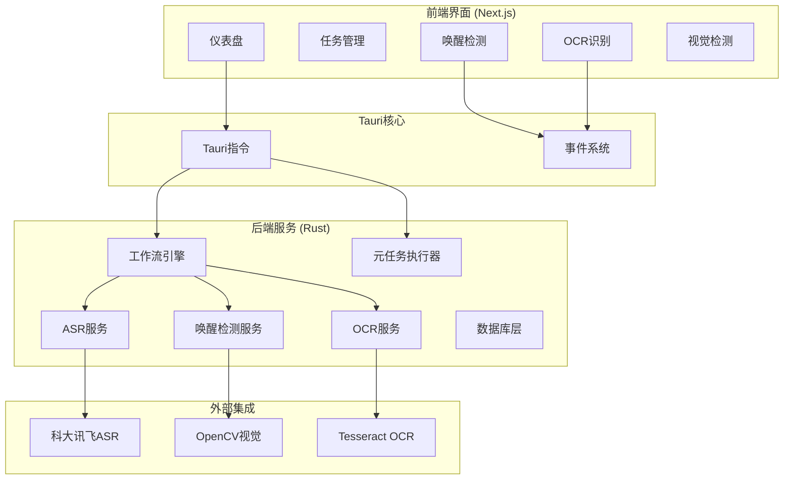

# 车机语音LLM自动化评估系统

一个基于 **Tauri** 和 **Next.js** 构建的桌面自动化测试应用，专注于车载语音助手的唤醒检测、语音识别和响应质量评估。

## 核心功能

- **任务管理**: 创建、配置和执行完整的测试任务，支持批量自动化测试
- **唤醒检测**: 视觉唤醒词检测（基于OpenCV模板匹配）和音频唤醒测试
- **语音识别**: 集成科大讯飞ASR API进行实时语音识别
- **OCR识别**: 车机显示屏文本识别和稳定性检测
- **大模型分析**: 基于LLM的响应质量评估
- **实时工作流**: 支持暂停/恢复的自动化测试流程
- **模板管理**: 可视化模板管理，支持ROI区域选择
- **本地数据持久化**: SQLite数据库存储所有测试数据

## 技术栈

### 前端
- **框架**: Next.js 15.2.4 (App Router)
- **UI**: Shadcn UI, Radix UI, Tailwind CSS
- **状态管理**: Redux Toolkit
- **路由**: `/llm-analysis`, `/taskmanage`, `/casemanage`, `/settings`, `/wake-detection-workflow`

### 后端
- **框架**: Tauri v2 + Rust
- **异步运行时**: Tokio
- **数据库**: SQLite + SQLx
- **音频**: Rodio播放, CPAL音频捕获
- **OCR**: Tesseract引擎池（6并发）
- **视觉**: OpenCV模板匹配
- **ASR**: 科大讯飞WebSocket API

### 系统架构



## 工作流系统

### 完整测试工作流
```
唤醒词播放 → 语音指令播放 → 视觉唤醒检测 → OCR识别 → ASR识别 → LLM分析 → 结果保存
```

### 唤醒检测工作流
```
唤醒词播放 → 视觉唤醒检测 → 结果统计
```

### 核心组件
- **工作流引擎**: DAG任务调度，支持暂停/恢复
- **视觉唤醒检测**: OpenCV多尺度模板匹配，ROI区域支持
- **OCR服务**: 实时文本识别，稳定性检测，6引擎并发
- **ASR服务**: 科大讯飞实时语音识别

## 快速开始

### 环境要求
- **Node.js**: v18+
- **Rust**: v1.77+ (with Cargo)
- **Tauri CLI**: `cargo install tauri-cli`
- **macOS**: 需要音频录制和文件系统权限

### 安装与运行

1. **克隆仓库**
    ```bash
    git clone [仓库地址]
    cd [仓库目录]
    ```

2. **安装依赖**
    ```bash
    npm install
    ```

3. **启动开发环境**
    ```bash
    # 完整开发环境（推荐）
    npm run tauri dev
    
    # 仅前端开发
    npm run dev
    ```

4. **构建生产版本**
    ```bash
    npm run tauri build
    ```

## 项目结构

```
/LLM Analysis Interface
├── app/                          # Next.js页面路由
├── components/                   # React组件
│   ├── llm-analysis-interface.tsx
│   ├── wake-detection-workflow.tsx
│   ├── ocr.tsx
│   ├── visual-wake-detection.tsx
│   └── template-manager.tsx
├── hooks/                        # 自定义Hooks
├── services/                     # Tauri API封装
├── store/                        # Redux状态管理
├── public/templates/             # 视觉检测模板
└── src-tauri/                    # Tauri后端
    ├── src/
    │   ├── commands.rs          # Tauri指令定义
    │   ├── models.rs            # 数据模型
    │   ├── services/
    │   │   ├── meta_task_executor.rs    # 完整工作流
    │   │   ├── wake_detection_meta_executor.rs  # 唤醒检测工作流
    │   │   ├── analysis_task.rs         # 分析任务
    │   │   ├── asr_task.rs              # ASR任务
    │   │   ├── ocr_task.rs              # OCR任务
    │   │   └── checkpoint_task.rs       # 检查点任务
    │   └── db/database.rs       # 数据库操作
```

## 核心功能详解

### 视觉唤醒检测
- **实时视频**: WebRTC摄像头访问，1-30 FPS可调
- **模板匹配**: 多尺度匹配（1.0, 0.8, 0.6, 0.4, 0.3, 0.2）
- **ROI选择**: 交互式画布区域选择
- **置信度**: 可配置的检测阈值（默认0.5）

### OCR识别系统
- **实时处理**: 6个Tesseract引擎并发处理
- **文本稳定**: 30帧滑动窗口，95%相似度阈值
- **坐标转换**: 显示坐标到视频坐标的自动转换
- **错误处理**: 5次连续错误自动终止

### 事件系统
- **视觉检测**: `visual_wake_event`, `visual_wake_status`
- **OCR**: `ocr_task_event` (start, ready, data, complete, error)
- **工作流**: `task_completed`

## Tauri核心指令

### 任务管理
- `get_all_tasks`: 获取所有测试任务
- `create_task`: 创建新任务
- `delete_task`: 删除任务
- `set_current_task`: 设置当前任务
- `start_automated_test`: 启动自动化测试
- `stop_testing`: 停止测试

### 样本管理
- `get_all_samples`: 获取测试样本
- `create_sample`: 创建样本
- `delete_sample`: 删除样本
- `get_all_wake_words`: 获取唤醒词

### 视觉检测
- `start_visual_wake_detection_with_data`: 启动视觉检测
- `push_video_frame_visual`: 推送视频帧
- `stop_visual_wake_detection`: 停止检测
- `save_template_image`: 保存模板
- `get_templates_from_folder`: 获取模板列表

### OCR系统
- `start_ocr_session`: 启动OCR会话
- `push_video_frame`: 推送OCR帧
- `stop_ocr_session`: 停止OCR会话

## 开发脚本

```bash
# 开发环境
npm run tauri dev          # 完整开发环境
npm run dev               # 仅前端开发

# 构建
npm run build             # 构建Next.js
npm run tauri build       # 构建Tauri应用

# 代码质量
npm run lint              # ESLint检查
npm run start             # 生产服务器
```

## 数据模型

### 核心实体
- **Task**: 测试任务配置
- **Sample**: 测试样本（文本/音频）
- **WakeWord**: 唤醒词配置
- **AnalysisResult**: 分析结果
- **WakeDetectionResult**: 唤醒检测结果
- **TimingData**: 精确时间数据

## 性能优化

- **并发处理**: OCR 6引擎并发，视觉检测实时处理
- **内存管理**: 100帧缓冲区，自动垃圾回收
- **错误恢复**: 自动重试和优雅降级
- **资源清理**: 任务完成自动释放资源

## 打包部署注意事项

### 平台差异

#### Windows平台
- **OpenCV**: 使用静态链接，无需额外安装OpenCV运行时
- **Tesseract**: 静态链接tesseract库，打包时自动包含
- **依赖**: 所有依赖静态链接到可执行文件中
- **大小**: 由于静态链接，最终包体积较大（约100-200MB）

#### macOS平台
- **OpenCV**: 使用系统动态链接，依赖系统安装的OpenCV
- **Tesseract**: 使用系统动态链接，需要安装tesseract
- **安装要求**: 
  ```bash
  # 安装依赖
  brew install opencv
  brew install tesseract
  ```
- **包大小**: 由于动态链接，包体积相对较小（约50-80MB）

### 打包配置

#### Windows打包
```bash
# 确保Cargo.toml中包含静态链接配置
# [target.x86_64-pc-windows-msvc.dependencies]
# opencv = { version = "0.88", features = ["opencv-4", "buildtime-bindgen"] }
# tesseract-sys = { version = "0.11", features = ["static-link"] }

npm run tauri build
$env:VCPKG_ROOT = "D:\Code\Auto-Evalution-App\depends\vcpkg-master"
配置libclang环境变量
$env:LIBCLANG_PATH = "D:\Code\Auto-Evalution-App\depends\clang+llvm-18.1.8-x86_64-pc-windows-msvc\bin"
Opencv需要Clang二进制文件来生成绑定，需要将clang的bin目录添加到PATH中
$env:PATH += "D:\Code\Auto-Evalution-App\depends\clang+llvm-18.1.8-x86_64-pc-windows-msvc\bin"
```

#### macOS打包
```bash
# 确保系统已安装依赖
brew install opencv tesseract

# 打包
npm run tauri build
```

### 权限配置

#### macOS权限
在`src-tauri/tauri.conf.json`中配置权限：
```json
{
  "macOS": {
    "entitlements": "entitlements.plist"
  }
}
```

创建`src-tauri/entitlements.plist`：
```xml
<?xml version="1.0" encoding="UTF-8"?>
<!DOCTYPE plist PUBLIC "-//Apple//DTD PLIST 1.0//EN" "http://www.apple.com/DTDs/PropertyList-1.0.dtd">
<plist version="1.0">
<dict>
    <key>com.apple.security.device.camera</key>
    <true/>
    <key>com.apple.security.device.audio-input</key>
    <true/>
    <key>com.apple.security.files.user-selected.read-write</key>
    <true/>
</dict>
</plist>
```

### 常见问题

#### Windows
1. **MSVC工具链**: 确保安装Visual Studio Build Tools
2. **OpenCV版本**: 使用vcpkg或预编译静态库
3. **运行时错误**: 检查Visual C++ Redistributable

#### macOS
1. **摄像头权限**: 需要在系统偏好设置中授予权限
2. **音频权限**: 首次运行时会提示麦克风权限
3. **OpenCV路径**: 确保`/usr/local/lib/libopencv*.dylib`存在
4. **Tesseract路径**: 确保`/usr/local/bin/tesseract`可访问

### 调试工具
- **控制台日志**: 查看详细操作信息
- **事件监控**: 监听Tauri事件状态
- **性能监控**: OCR FPS和错误率实时显示
- **权限检查**: 
  ```bash
  # macOS检查权限
  tccutil reset Camera
  tccutil reset Microphone
  ```