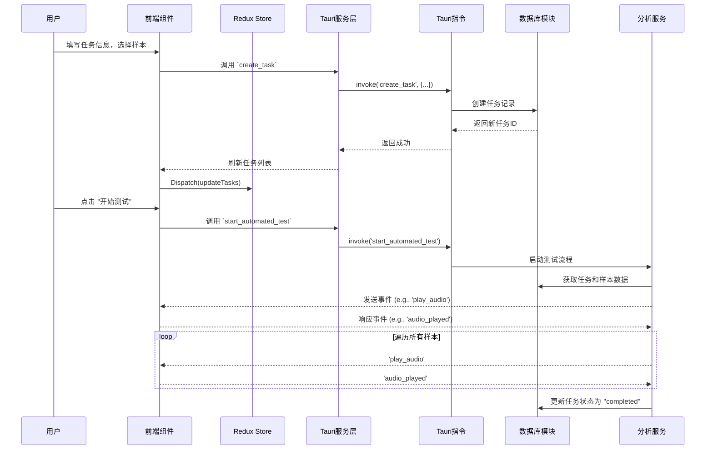

# 技术文档：车机语音LLM自动化评估系统

## 1. 引言

本文档旨在详细阐述“车机语音LLM自动化评估系统”的设计与实现。该系统是一个基于 Tauri 和 Next.js 构建的跨平台桌面应用，旨在为车载语音助手的开发和测试团队提供一个高效、自动化的评估工具。

应用的核心是围绕**任务 (Task)**、**测试样本 (Test Sample)** 和 **唤醒词 (Wake Word)** 进行的。用户可以创建包含多个测试样本的测试任务，然后启动自动化流程，系统将模拟用户交互，记录车机响应，并（在未来）提供基于大语言模型（LLM）的智能分析和评分。

## 2. 系统架构

系统采用前后端分离的架构，并通过 Tauri 作为桥梁进行整合。

- **前端 (Frontend):** 使用 Next.js 构建，负责提供完整的用户交互界面。
- **后端 (Backend):** 使用 Rust 编写，负责处理所有业务逻辑、数据库操作和与操作系统的交互。
- **通信 (Communication):** 前后端通过 Tauri 的 Command 机制进行异步通信。前端通过 `invoke` 调用后端 Rust 函数，后端通过 `Event` 向前端发送消息。
- **数据存储 (Data Persistence):** 使用内置的 SQLite 数据库，通过 `sqlx` 库在 Rust 后端进行管理，实现了数据的本地化持久存储。

### 2.1 架构图

```mermaid
graph TD
    subgraph "用户界面 (Frontend - Next.js)"
        direction LR
        Pages[页面 (App Router)]
        Components[React 组件]
        State[状态管理 (Redux)]
        Services[Tauri API 服务]
    end

    subgraph "核心 (Tauri Core)"
        WebView[WebView (渲染前端)]
        CommandBridge[Rust-JS Command Bridge]
        EventSystem[事件系统]
    end

    subgraph "应用后端 (Backend - Rust)"
        direction LR
        TauriCommands[Tauri Commands API]
        BusinessLogic[业务逻辑 (Services)]
        Database[数据库模块 (SQLx)]
    end

    subgraph "数据存储"
        SQLite[SQLite Database]
    end

    Pages & Components -- "Dispatch Actions" --> State
    State -- "Updates" --> Pages & Components
    Pages & Components -- "Call" --> Services
    Services -- "invoke" --> CommandBridge

    CommandBridge -- "Calls" --> TauriCommands
    TauriCommands -- "Uses" --> BusinessLogic
    BusinessLogic -- "Accesses" --> Database
    Database -- "CRUD" --> SQLite

    BusinessLogic -- "Emit" --> EventSystem
    EventSystem -- "Sends Event" --> Services
```

## 3. 前端设计与实现

前端基于 Next.js 的 App Router 构建，提供了现代化的、基于组件的开发体验。

### 3.1. 目录结构

```
/
├── app/                    # 页面路由
│   ├── casemanage/         # 用例管理页面
│   ├── llm-analysis/       # LLM分析页面
│   ├── taskmanage/         # 任务管理页面
│   └── ...
├── components/             # 可复用UI组件
│   ├── ui/                 # Shadcn UI 基础组件
│   └── custom/             # 自定义业务组件
├── hooks/                  # 自定义React Hooks
├── services/               # Tauri API调用封装
├── store/                  # Redux Toolkit Slices
└── types/                  # TypeScript类型定义
```

### 3.2. 状态管理 (Redux Toolkit)

应用使用 Redux Toolkit 进行全局状态管理，主要包含以下几个 slice：

- **`taskSlice.ts`**: 管理任务列表、当前任务ID以及与任务相关的状态。
- **`samplesSlice.ts`**: 管理测试样本和唤醒词列表。

通过集中的状态管理，确保了数据在不同组件间的一致性和可预测性。

### 3.3. 与后端通信

所有与 Tauri 后端的通信都封装在 `services/` 目录下的文件中。

- **`services/tauri-api.ts`**: 封装了对 `src-tauri/src/commands.rs` 中定义的指令的调用。每个函数都对应一个 Tauri Command，使用 `@tauri-apps/api/core` 的 `invoke` 函数来执行。
- **`hooks/useTauriTasks.ts`** 和 **`hooks/useTauriSamples.ts`**: 这些自定义 Hooks 进一步封装了 `tauri-api.ts` 中的服务调用，并与 Redux store 进行交互，实现了数据的获取、更新和组件的自动重新渲染。

这种分层设计使得组件代码更加简洁，业务逻辑和数据获取逻辑被清晰地分离。

## 4. 后端设计与实现 (Rust)

后端是应用的核心，负责处理所有复杂的业务逻辑和数据持久化。

### 4.1. 目录结构

```
/src-tauri
├── src/
│   ├── analysis_service.rs # 自动化测试核心逻辑
│   ├── commands.rs     # 暴露给前端的Tauri指令
│   ├── database.rs     # 数据库交互模块 (SQLx)
│   ├── lib.rs          # Rust库入口和Tauri插件初始化
│   ├── models.rs       # 数据库表对应的数据模型
│   └── state.rs        # Tauri管理的共享应用状态
├── Cargo.toml          # Rust项目依赖
└── tauri.conf.json     # Tauri应用配置
```

### 4.2. 数据库 (`database.rs` & `models.rs`)

- **`models.rs`**: 定义了与数据库表结构对应的 Rust `struct`，例如 `Task`, `TestSample`, `WakeWord`。这些结构都派生了 `sqlx::FromRow` 和 `serde::Serialize`，以便于从数据库读取和序列化为JSON。
- **`database.rs`**: 包含一个 `Database` 结构体，它持有一个 `sqlx::SqlitePool` 连接池。所有数据库的CRUD（创建、读取、更新、删除）操作都作为 `Database` 的方法来实现。这种封装确保了数据库逻辑的集中和可维护性。

### 4.3. Tauri 指令 (`commands.rs`)

这是前端和后端之间的 **API层**。所有标记为 `#[tauri::command]` 的函数都可以被前端通过 `invoke` 调用。这些函数接收 `tauri::State` 作为参数来访问共享的应用状态（如数据库连接池），并处理前端发送过来的数据，调用相应的业务逻辑，最后返回 `Result` 类型给前端。

### 4.4. 共享状态 (`state.rs`)

- **`AppState`**: 定义了一个全局共享状态结构体，其中包含了 `Database` 实例和一些用于控制测试流程的原子状态（如 `current_task_id`, `is_testing`）。
- 在 `main.rs` (或 `lib.rs`) 中，`AppState` 的实例被创建并通过 `.manage()` 方法交由 Tauri 管理。这使得每个指令函数都能安全地访问到同一个数据库连接池和共享状态，避免了资源冲突。

### 4.5. 自动化测试服务 (`analysis_service.rs`)

`AnalysisService` 结构体封装了自动化测试的核心流程。当 `start_automated_test` 指令被调用时，它会：
1.  获取当前任务及其关联的测试样本。
2.  进入一个循环，按顺序处理每个样本。
3.  通过 Tauri 的事件系统向前端发送事件（例如 `update-progress`），通知前端播放特定音频。
4.  等待前端完成操作（例如，通过监听前端回传的事件）。
5.  (待实现) 捕获车机响应，并进行分析。
6.  更新任务进度和状态。

## 5. 数据流示例：创建并执行一个测试任务



## 6. 构建与部署

### 6.1. 开发环境设置

1.  **安装 Rust**: 访问 [rust-lang.org](https://www.rust-lang.org/)。
2.  **安装 Node.js**: 访问 [nodejs.org](https://nodejs.org/)。
3.  **安装 Tauri CLI**:
    ```bash
    cargo install tauri-cli
    ```
4.  **安装项目依赖**:
    ```bash
    npm install
    ```

### 6.2. 启动开发

```bash
npm run tauri dev
```

### 6.3. 构建应用

```bash
npm run tauri build
```
该命令会在 `src-tauri/target/release/bundle/` 目录下生成对应操作系统的安装包（例如 `.dmg` for macOS, `.msi` for Windows）。
