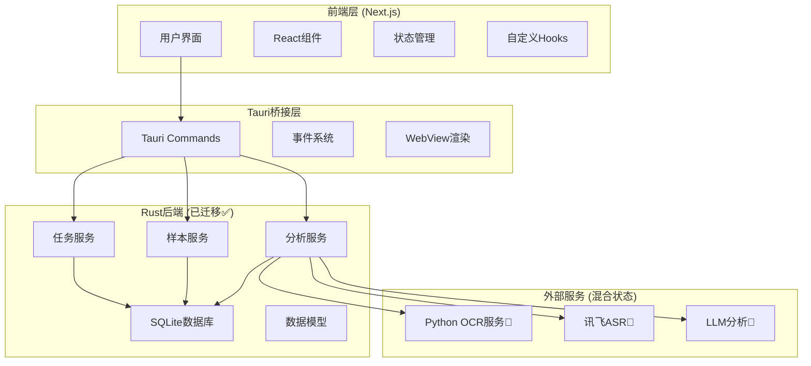

# 车机语音LLM自动化评估系统 - 应用测试说明文档

## 目录
1. [应用概述](#应用概述)
2. [环境准备与系统要求](#环境准备与系统要求)
3. [应用架构与迁移状态](#应用架构与迁移状态)
4. [安装与配置指南](#安装与配置指南)
5. [功能模块测试指南](#功能模块测试指南)
6. [集成测试场景](#集成测试场景)
7. [性能与兼容性测试](#性能与兼容性测试)
8. [故障排除指南](#故障排除指南)
9. [已知限制与开发计划](#已知限制与开发计划)

---

## 应用概述

车机语音LLM自动化评估系统是一个基于 **Tauri v2** 和 **Next.js** 构建的跨平台桌面应用，专注于自动化测试和评估车载语音助手的响应质量。

### 核心功能
- **任务管理**: 创建、配置和执行测试任务，跟踪任务状态和进度
- **用例管理**: 管理测试样本和唤醒词，支持音频文件关联
- **自动化测试**: 执行预定义的测试流程，包括音频播放和响应记录
- **OCR识别**: 实时识别车机屏幕内容（依赖Python后端服务）
- **LLM分析**: 对车机响应进行智能分析和评分
- **本地数据持久化**: 使用SQLite数据库安全存储所有数据

### 技术栈
- **前端**: Next.js 15.2.4, Shadcn UI, Tailwind CSS, Redux Toolkit
- **后端**: Tauri v2, Rust, SQLx + SQLite
- **外部服务**: Python OCR服务器, 讯飞ASR API

---

## 环境准备与系统要求

### 系统要求

#### macOS
- **版本**: macOS Catalina (10.15) 或更新版本
- **开发工具**: Xcode（完整版本，非命令行工具）
- **安装方式**: 
  - [Mac App Store](https://apps.apple.com/cn/app/xcode/id497799835?mt=12)
  - [Apple Developer 网站](https://developer.apple.com/cn/xcode/resources/)

#### Windows
- **版本**: Windows 7 或更新版本
- **必需组件**:
  - Microsoft C++ 生成工具
  - Microsoft Edge WebView2（Windows 10 1803+已预装）
- **安装步骤**:
  1. 下载并安装 [Microsoft C++ 生成工具](https://visualstudio.microsoft.com/zh-hans/visual-cpp-build-tools/)
  2. 选择"使用 C++ 的桌面开发"选项
  3. 下载并安装 [WebView2 运行时](https://developer.microsoft.com/zh-cn/microsoft-edge/webview2/#download)

#### Linux
支持主流发行版，以Ubuntu/Debian为例：
```bash
sudo apt update
sudo apt install libwebkit2gtk-4.1-dev \
  build-essential \
  curl \
  wget \
  file \
  libxdo-dev \
  libssl-dev \
  libayatana-appindicator3-dev \
  librsvg2-dev
```

### 开发环境依赖

#### 1. Rust 安装
```bash
# Linux/macOS
curl --proto '=https' --tlsv1.2 https://sh.rustup.rs -sSf | sh

# Windows (PowerShell)
winget install --id Rustlang.Rustup
```

**重要**: Windows用户确保使用MSVC工具链：
```bash
rustup default stable-msvc
```

#### 2. Node.js 安装
- 访问 [Node.js 官网](https://nodejs.org/zh-cn) 下载LTS版本
- 验证安装：
```bash
node -v  # 应显示 v18+ 版本
npm -v   # 应显示对应npm版本
```

#### 3. Tauri CLI 安装
```bash
cargo install tauri-cli
```

### 外部服务依赖

#### Python OCR 服务器
- **端口**: 8765 (WebSocket)
- **功能**: 实时OCR识别
- **状态**: 🔄 需要独立部署

#### 讯飞ASR API
- **功能**: 语音识别服务
- **配置**: 需要API密钥
- **状态**: 🔄 外部服务集成

---

## 应用架构与迁移状态

### 系统架构图



### 功能迁移状态

#### ✅ 已完成迁移（Rust后端）
- **任务管理**
  - `get_all_tasks`: 获取所有任务
  - `create_task`: 创建新任务
  - `delete_task`: 删除任务
  - `set_current_task`: 设置当前任务
  - `update_task_status`: 更新任务状态

- **样本管理**
  - `get_all_samples`: 获取所有测试样本
  - `create_sample`: 创建单个样本
  - `create_samples_batch`: 批量创建样本
  - `delete_sample`: 删除样本
  - `get_samples_by_task_id`: 获取任务关联样本

- **唤醒词管理**
  - `get_all_wake_words`: 获取所有唤醒词
  - `create_wake_word`: 创建唤醒词

- **数据库操作**
  - SQLite集成完成
  - 完整的CRUD操作
  - 数据模型定义完善

- **分析服务基础**
  - `submit_analysis`: 提交分析
  - `get_analysis_results`: 获取分析结果
  - `get_machine_responses`: 获取车机响应

#### 🔄 部分迁移/开发中
- **自动化测试流程**
  - `start_automated_test`: 基础功能已实现
  - `stop_testing`: 停止测试功能
  - ⚠️ 任务暂停/恢复功能待完善
  - ⚠️ 上一条/下一条导航待实现

- **OCR识别模块**
  - 前端界面完成
  - 依赖Python WebSocket服务器
  - 摄像头集成和ROI选择功能完善

- **语音识别集成**
  - 讯飞ASR API集成
  - 音频处理功能

#### ⚠️ 待完善功能
- Excel导出功能参数完善
- 唤醒词导入功能
- 动态路由静态导出问题
- 交互界面完成按钮
- 测试任务成功率计算

#### 🔄 仍使用Next.js API路由
以下API路由尚未迁移到Rust后端：
- `/api/analyze/route.ts`
- `/api/audio-files/route.ts`
- `/api/env-test/route.ts`
- `/api/speech-recognition/route.ts`
- `/api/test-samples/route.ts`
- `/api/test-tasks/route.ts`
- `/api/wakeword/route.ts`
- `/api/wakeword-files/route.ts`
- `/api/xunfei-asr/route.ts`

---

## 安装与配置指南

### 步骤1: 环境验证

验证系统环境是否满足要求：

```bash
# 检查Rust安装
rustc --version
cargo --version

# 检查Node.js安装
node --version
npm --version

# 检查Tauri CLI
cargo tauri --version
```

### 步骤2: 项目安装

```bash
# 1. 克隆项目
git clone [项目仓库地址]
cd LLM-Analysis-Interface

# 2. 安装前端依赖
npm install

# 3. 验证项目结构
ls -la  # 确认存在 src-tauri 目录

# 4. 检查Tauri配置
cat src-tauri/tauri.conf.json
```

### 步骤3: 开发环境启动

```bash
# 启动开发环境（推荐）
npm run tauri dev

# 或者分别启动
npm run dev          # 仅启动Next.js前端
npm run tauri build  # 构建生产版本
```

### 步骤4: 外部服务配置

#### Python OCR服务器配置

```bash
git clone [项目python后端]

# OCR服务器
cd autotest-system
pip install -r requirements.txt
python OCRBackend.py  # 启动在localhost:8765
```

#### LLM大模型验证服务

```bash
1. 克隆仓库
2. 安装依赖：
   pip install -r requirements.txt
3. 配置环境变量（.env文件）：
   OPENROUTER_API_KEY=your_api_key
   DASHSCOPE_API_KEY=your_api_key
   
### 运行服务
uvicorn src.main:app --reload

```

#### 讯飞ASR配置

在环境变量或配置文件中设置：
```bash
export XUNFEI_APP_ID="your_app_id"
export XUNFEI_API_SECRET="your_api_secret"
export XUNFEI_API_KEY="your_api_key"
```

### 步骤5: 数据库初始化验证

应用首次启动时会自动初始化SQLite数据库。验证数据库是否正常：

1. 启动应用
2. 尝试创建一个测试任务
3. 检查任务是否正确保存
4. 验证数据持久化功能

---

## 功能模块测试指南

### 5.1 任务管理模块 (✅已迁移)

#### 测试场景1: 创建新任务
**前置条件**: 
- 应用已启动
- 至少有一个测试样本和唤醒词

**测试步骤**:
1. 导航到"任务管理"页面
2. 点击"创建任务"按钮
3. 填写任务信息：
   - 任务名称: "测试任务001"
   - 选择测试样本（至少1个）
   - 选择唤醒词
4. 点击"创建"按钮

**预期结果**:
- 任务创建成功提示
- 任务列表中显示新任务
- 任务状态为"pending"
- 任务进度为0%

**验证点**:
- 数据库中正确保存任务信息
- 任务ID自动生成
- 关联的样本ID正确存储

#### 测试场景2: 任务状态管理
**测试步骤**:
1. 选择一个已创建的任务
2. 点击"设为当前任务"
3. 验证当前任务状态更新
4. 尝试删除任务
5. 确认删除操作

**预期结果**:
- 当前任务正确设置
- 删除操作成功
- 如果删除的是当前任务，当前任务ID被清除

#### 测试场景3: 任务进度跟踪
**测试步骤**:
1. 创建包含多个样本的任务
2. 启动自动化测试
3. 观察进度更新
4. 验证进度计算准确性

**预期结果**:
- 进度百分比正确计算
- 当前/总数显示准确
- 实时更新进度状态

### 5.2 用例管理模块 (✅已迁移)

#### 测试场景1: 测试样本管理
**测试步骤**:
1. 导航到"用例管理"页面
2. 点击"添加测试样本"
3. 输入样本文本: "请播放音乐"
4. 可选：上传音频文件
5. 保存样本

**预期结果**:
- 样本创建成功
- 样本列表更新
- 音频文件正确关联（如果上传）

#### 测试场景2: 批量样本创建
**测试步骤**:
1. 准备多个样本数据
2. 使用批量创建功能
3. 验证所有样本正确创建

**预期结果**:
- 所有样本成功创建
- 返回创建的样本ID列表
- 数据库中正确存储

#### 测试场景3: 唤醒词管理
**测试步骤**:
1. 创建新唤醒词: "小度小度"
2. 上传对应音频文件
3. 验证唤醒词可用于任务创建

**预期结果**:
- 唤醒词创建成功
- 音频文件正确关联
- 在任务创建时可选择该唤醒词

#### 测试场景4: 样本删除安全性
**测试步骤**:
1. 创建一个任务并关联某个样本
2. 尝试删除该样本
3. 使用安全删除功能

**预期结果**:
- 普通删除可能失败（如果有关联）
- 安全删除会检查关联关系
- 提供适当的错误提示

### 5.3 自动化测试模块 (🔄部分迁移)

#### 测试场景1: 基础测试流程
**前置条件**:
- 已创建任务并设为当前任务
- 任务包含测试样本和唤醒词

**测试步骤**:
1. 点击"开始自动化测试"
2. 观察测试流程启动
3. 监控事件发送和接收
4. 验证音频播放指令
5. 提交车机响应
6. 查看分析结果

**预期结果**:
- 测试流程正常启动
- 事件系统正常工作
- 进度正确更新
- 结果正确保存

#### 测试场景2: 测试中断和恢复
**测试步骤**:
1. 启动自动化测试
2. 在测试过程中点击"停止测试"
3. 验证测试状态更新
4. 尝试重新启动测试

**预期结果**:
- 测试正确停止
- 状态标志正确更新
- 可以重新启动测试

**已知限制**:
- ⚠️ 任务暂停/恢复功能待完善
- ⚠️ 断点续传功能未实现

#### 测试场景3: 分析结果处理
**测试步骤**:
1. 完成一个样本的测试
2. 提交车机响应文本
3. 查看分析结果
4. 验证评分计算

**预期结果**:
- 分析结果正确生成
- 评分合理
- 结果正确存储到数据库

### 5.4 OCR识别模块 (🔄需Python后端)

#### 前置条件验证
**检查清单**:
- [ ] Python OCR服务器运行在localhost:8765
- [ ] 摄像头设备可用
- [ ] 摄像头权限已授予应用
- [ ] WebSocket连接正常

#### 测试场景1: 摄像头初始化
**测试步骤**:
1. 打开OCR识别页面
2. 检查摄像头设备列表
3. 选择摄像头设备
4. 验证视频流显示

**预期结果**:
- 摄像头列表正确显示
- 视频流正常显示
- FPS计数器工作正常

**常见问题**:
- 摄像头权限被拒绝
- 设备列表为空
- 视频流无法显示

#### 测试场景2: ROI区域选择
**测试步骤**:
1. 确保视频流正常
2. 点击"选择ROI区域"按钮
3. 在视频画面上拖拽选择区域
4. 确认ROI设置

**预期结果**:
- ROI选择界面正常
- 拖拽操作响应
- ROI区域正确标记
- 区域坐标正确计算

#### 测试场景3: 实时OCR识别
**前置条件**: Python OCR服务器正常运行

**测试步骤**:
1. 设置好ROI区域（可选）
2. 点击"开始OCR识别"
3. 在摄像头前放置包含文字的物体
4. 观察识别结果

**预期结果**:
- WebSocket连接成功
- 实时发送视频帧
- 接收OCR识别结果
- 结果正确显示在界面上
- 置信度信息准确

**性能指标**:
- 识别延迟 < 1秒
- 识别准确率 > 90%（清晰文字）
- 帧率稳定

#### 测试场景4: OCR设置调整
**测试步骤**:
1. 调整OCR识别间隔
2. 测试不同间隔下的性能
3. 验证设置保存

**预期结果**:
- 间隔设置生效
- 性能相应调整
- 设置正确保存

### 5.5 LLM分析模块 (🔄需python后端)

#### 测试场景1: 车机响应分析
**测试步骤**:

1. 提交车机响应文本
2. 等待LLM分析完成
3. 查看分析结果

**预期结果**:
- 语义正确性评分
- 状态变更确认评分
- 表达明确性评分
- 总体评分
- 改进建议

#### 测试场景2: 分析结果存储
**测试步骤**:
1. 完成多个样本分析
2. 查看历史分析结果
3. 验证数据持久化

**预期结果**:
- 所有分析结果正确保存
- 可以查询历史记录
- 数据关联正确

---

## 集成测试场景

### 6.1 完整测试流程

#### 端到端测试场景
**目标**: 验证从任务创建到结果分析的完整流程

**测试步骤**:

1. **准备阶段**
   - 启动应用
   - 验证外部服务连接
   - 创建测试样本和唤醒词

2. **任务创建阶段**
   - 创建新测试任务
   - 配置任务参数
   - 关联测试样本和唤醒词
   - 设为当前任务

3. **测试执行阶段**
   - 启动自动化测试
   - 监控测试进度
   - 处理音频播放事件
   - 记录车机响应

4. **结果分析阶段**
   - 提交车机响应进行分析
   - 查看LLM分析结果
   - 验证评分合理性

5. **数据验证阶段**
   - 检查数据库存储
   - 验证结果完整性
   - 测试数据导出功能

**预期结果**:
- 整个流程无错误完成
- 所有数据正确保存
- 分析结果合理
- 性能指标达标

**成功标准**:
- 流程完成率 100%
- 数据完整性 100%
- 响应时间 < 5秒
- 错误率 < 1%

### 6.2 异常情况测试

#### 网络中断测试
**测试步骤**:
1. 启动OCR识别
2. 断开网络连接
3. 观察应用行为
4. 恢复网络连接

**预期结果**:
- 应用不崩溃
- 错误提示友好
- 网络恢复后自动重连

#### 外部服务不可用测试
**测试步骤**:
1. 停止Python OCR服务器
2. 尝试启动OCR识别
3. 验证错误处理

**预期结果**:
- 连接失败提示清晰
- 应用功能不受影响
- 可以重试连接

---

## 兼容性测试

### 7.1 兼容性测试

#### 操作系统兼容性
**测试矩阵**:

| 操作系统 | 版本 | 状态 | 备注 |
|---------|------|------|------|
| macOS | 10.15+ | ✅ 支持 | 需要Xcode |
| Windows | 10/11 | ✅ 支持 | 需要WebView2 |
| Windows | 7/8 | ⚠️ 有限支持 | 需要手动安装WebView2 |
| Ubuntu | 20.04+ | ✅ 支持 | 需要系统依赖 |
| CentOS | 7+ | ⚠️ 有限支持 | 依赖包可能需要编译 |

#### 硬件兼容性
**摄像头设备**:
- USB摄像头: ✅ 支持
- 内置摄像头: ✅ 支持
- 网络摄像头: ⚠️ 部分支持
- 多摄像头: ✅ 支持切换

**音频设备**:
- 内置扬声器: ✅ 支持
- USB音箱: ✅ 支持
- 蓝牙音箱: ⚠️ 部分支持
- 多音频设备: ✅ 支持切换

#### 分辨率兼容性
**测试分辨率**:
- 1920x1080: ✅ 完全支持
- 1366x768: ✅ 完全支持
- 2560x1440: ✅ 完全支持
- 4K (3840x2160): ✅ 完全支持
- 超宽屏: ⚠️ 布局可能需要调整

---

## 故障排除指南

### 8.1 常见问题与解决方案

#### 应用启动问题

**问题1: 应用无法启动**
```
错误信息: "Failed to initialize Tauri application"
```
**解决方案**:
1. 检查Rust环境安装
```bash
rustc --version
cargo --version
```
2. 重新安装Tauri CLI
```bash
cargo install tauri-cli --force
```
3. 清理并重新构建
```bash
cargo clean
npm run tauri dev
```

**问题2: WebView初始化失败**
```
错误信息: "WebView2 not found"
```
**解决方案** (Windows):
1. 下载并安装WebView2运行时
2. 重启应用
3. 检查Windows版本兼容性

**问题3: 权限问题**
```
错误信息: "Permission denied"
```
**解决方案** (macOS):
1. 检查应用权限设置
2. 在系统偏好设置中授予摄像头权限
3. 重新启动应用

#### 数据库问题

**问题1: 数据库连接失败**
```
错误信息: "Database connection failed"
```
**解决方案**:
1. 检查数据库文件权限
2. 清理数据库文件重新初始化
3. 检查磁盘空间

**问题2: 数据库迁移失败**
```
错误信息: "Migration failed"
```
**解决方案**:
1. 备份现有数据
2. 删除数据库文件
3. 重新启动应用进行初始化

#### OCR服务问题

**问题1: 无法连接OCR服务器**
```
错误信息: "WebSocket connection failed"
```
**解决方案**:
1. 检查Python OCR服务器状态
```bash
netstat -an | grep 8765
```
2. 验证服务器地址配置
3. 检查防火墙设置

**问题2: 摄像头无法访问**
```
错误信息: "Camera access denied"
```
**解决方案**:
1. 检查系统摄像头权限
2. 关闭其他使用摄像头的应用
3. 重新启动应用

#### 语音识别问题

**问题1: 讯飞ASR连接失败**
```
错误信息: "ASR service connection failed"
```
**解决方案**:
1. 检查API密钥配置
2. 验证网络连接
3. 检查API配额限制

**问题2: 音频设备问题**
```
错误信息: "Audio device not found"
```
**解决方案**:
1. 检查音频设备连接
2. 更新音频驱动程序
3. 重新选择音频设备

### 8.2 调试工具与方法

#### 前端调试
**开发者工具**:
1. 打开应用
2. 按F12或右键选择"检查元素"
3. 查看Console标签页的错误信息
4. 检查Network标签页的网络请求

**Redux状态调试**:
1. 安装Redux DevTools扩展
2. 监控状态变化
3. 分析action派发

#### Rust后端调试
**日志查看**:
```bash
# 启动时启用详细日志
RUST_LOG=debug npm run tauri dev

# 查看特定模块日志
RUST_LOG=tauri_app::database=debug npm run tauri dev
```

**数据库调试**:
```bash
# 使用SQLite命令行工具
sqlite3 src-tauri/data/app.db
.tables
.schema tasks
SELECT * FROM tasks;
```

#### 网络调试
**WebSocket连接调试**:
1. 使用浏览器开发者工具
2. 查看WebSocket连接状态
3. 监控消息发送和接收

**API请求调试**:
```bash
# 使用curl测试API
curl -X GET http://localhost:3000/api/test-samples
curl -X POST http://localhost:3000/api/tasks \
  -H "Content-Type: application/json" \
  -d '{"name":"test","samples":[1,2,3]}'
```

---

## 已知限制与开发计划

### 9.1 当前已知限制

#### 功能限制
1. **OCR识别依赖**: 需要独立的Python服务器，增加部署复杂性
2. **任务控制**: 缺少暂停/恢复功能，无法中断后继续测试
3. **导航控制**: 缺少上一条/下一条样本导航功能
4. **批量操作**: 唤醒词批量导入功能未实现
5. **导出功能**: Excel导出参数需要进一步完善

#### 技术限制
1. **混合架构**: 部分功能仍依赖Next.js API路由
2. **动态路由**: 静态导出时动态路由存在问题
3. **跨平台兼容性**: 某些功能在不同操作系统上表现不一致
4. **外部依赖**: 依赖多个外部服务，增加故障点

#### 性能限制
1. **大数据处理**: 处理大量测试数据时可能出现性能瓶颈
2. **实时处理**: OCR实时识别在低配置设备上可能卡顿
3. **并发限制**: 同时处理多个任务时性能下降
4. **内存使用**: 长时间运行可能出现内存占用过高

### 9.2 开发优先级与计划

#### 高优先级 (P0)
1. **完善自动化测试流程**
   - 实现任务暂停/恢复功能
   - 添加断点续传机制
   - 完善错误处理和重试逻辑

2. **解决动态路由问题**
   - 修复静态导出时的路由问题
   - 实现generateStaticParams函数
   - 优化路由性能

3. **完成API迁移**
   - 将剩余的Next.js API路由迁移到Rust
   - 统一错误处理机制
   - 优化数据传输格式

#### 中优先级 (P1)
1. **增强用户体验**
   - 实现上一条/下一条导航
   - 添加任务进度可视化
   - 完善交互反馈机制

2. **完善导出功能**
   - 实现Excel导出参数配置
   - 添加多种导出格式支持
   - 优化导出性能

3. **优化OCR集成**
   - 考虑将OCR功能集成到Rust后端
   - 减少外部依赖
   - 提高识别性能

#### 低优先级 (P2)
1. **功能增强**
   - 实现唤醒词批量导入
   - 添加测试任务成功率统计
   - 增加更多分析维度

2. **性能优化**
   - 优化数据库查询性能
   - 实现数据分页加载
   - 添加缓存机制

3. **扩展功能**
   - 支持更多音频格式
   - 添加测试报告模板
   - 实现数据备份恢复

### 9.3 技术债务

#### 代码质量
1. **重构遗留代码**: 清理未使用的Next.js API路由
2. **统一错误处理**: 建立统一的错误处理机制
3. **类型安全**: 完善TypeScript类型定义
4. **测试覆盖**: 增加单元测试和集成测试

#### 架构优化
1. **服务解耦**: 减少组件间的紧耦合
2. **状态管理**: 优化Redux状态结构
3. **数据流**: 简化数据流转路径
4. **模块化**: 提高代码模块化程度

#### 文档完善
1. **API文档**: 完善Rust后端API文档
2. **开发指南**: 编写详细的开发指南
3. **部署文档**: 完善部署和运维文档
4. **用户手册**: 编写用户使用手册

**文档版本**: v1.0  
**最后更新**: 2025年6月24日  
**适用版本**: Tauri v2 + Next.js 15.2.4
