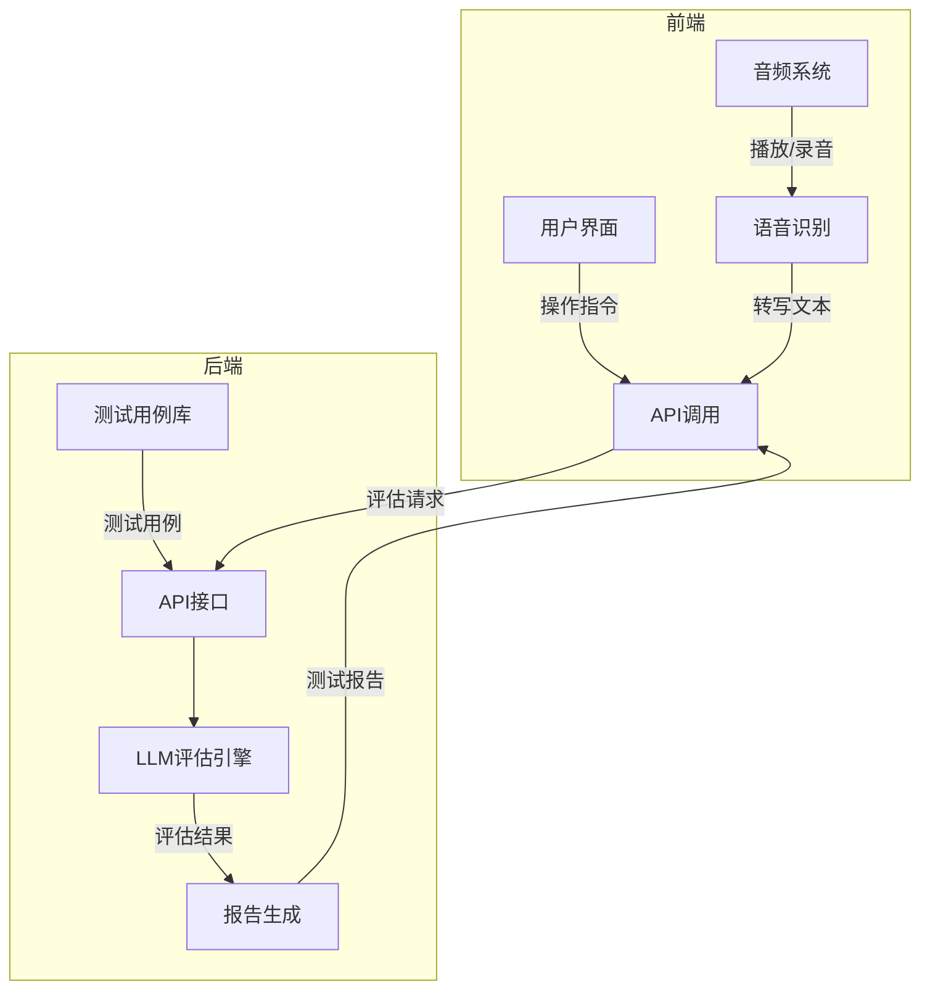
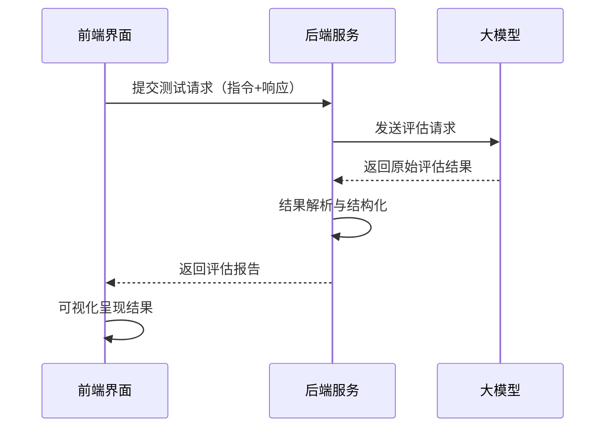
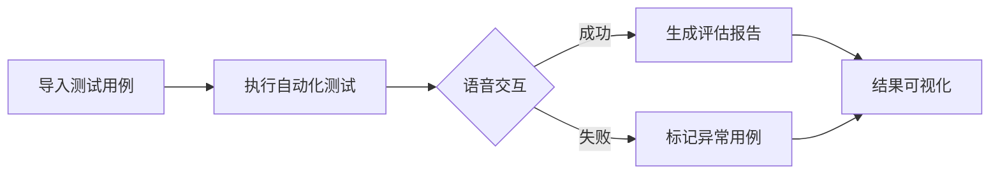
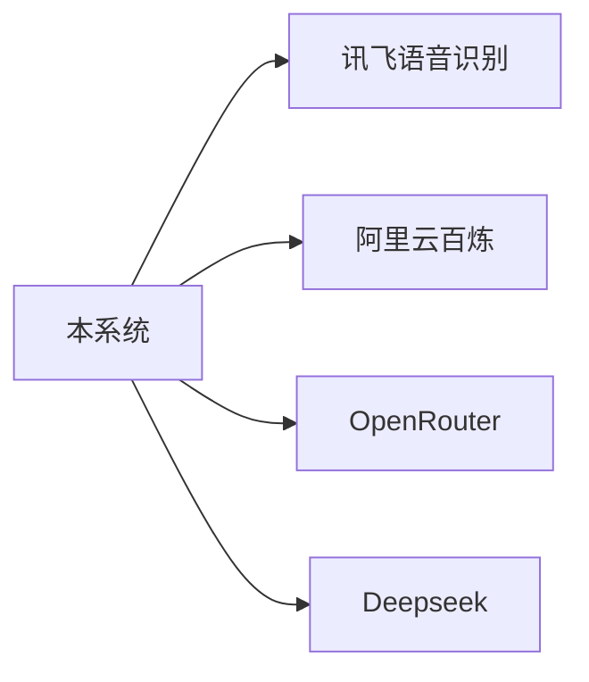

# 车机语音LLM自动化评估系统文档

## 1. 项目概述
本系统是一个自动化测试工具，通过LLM评估车机语音交互功能的正确性，替代人工测试流程。系统包含前后端组件，实现从测试用例管理、语音交互分析到结果可视化的全流程自动化。

## 2. 核心功能

### 2.1 后端功能

- **测试用例管理**：支持EXCEL格式的批量导入与管理
- **LLM评估引擎**：通过大模型判断指令-响应的匹配性
- **异常处理**：处理网络异常等情况
- **API接口**：提供RESTful API接口供外部系统调用

### 2.2 前端功能
- **测试样本管理**：创建/编辑/删除/导入测试语料
- **语音交互处理**：音频播放、录音及语音识别集成
- **多维度评分**：基于语义正确性、状态变更确认和表达无歧义性进行评分
- **实时可视化**：交互式数据表格和图表展示评估结果

## 3. 系统架构

### 3.1 整体架构


### 3.2 模块交互流程


## 4. 技术选型

### 4.1 后端技术栈
| 组件     | 方案      |
| -------- | --------- |
| 框架     | FastAPI   |
| LLM集成  | LangChain |
| 数据验证 | Pydantic  |
| 测试框架 | Pytest    |
| 并发处理 | asyncio   |

### 4.2 前端技术栈
| 组件     | 方案              |
| -------- | ----------------- |
| 框架     | Next.js 15        |
| UI组件   | Radix UI + Shadcn |
| 状态管理 | React Context     |
| 可视化   | Recharts          |
| 语音处理 | Web Audio API     |

## 5. 安装与部署

### 5.1 环境要求
- **后端**：Python 3.10+，LLM API密钥
- **前端**：Node.js 18+，npm 9+

### 5.2 后端安装
```bash
# 克隆仓库
git clone [后端仓库地址]
# 安装依赖
pip install -r requirements.txt
# 配置环境变量
echo "OPENROUTER_API_KEY=your_key" > .env
# 启动服务
python -m src.main
```

### 5.3 前端安装
```bash
# 克隆仓库
git clone [前端仓库地址]
# 安装依赖
npm install
# 启动服务
npm run dev
```

## 6. 系统使用流程

### 6.1 测试执行流程


### 6.2 API调用示例
```bash
# 评估请求
curl -X POST "http://localhost:8000/api/analyze" \
  -H "Content-Type: application/json" \
  -d '{"sample": "打开空调", "machineResponse": "空调已打开"}'

# 响应示例
{
  "assessment": {
    "semantic_correctness": {
      "score": 0,
      "comment": "响应未匹配核心功能需求（空调控制），仅反馈识别失败。"
    },
    "state_change_confirmation": {
      "score": 0,
      "comment": "未执行空调开关操作，未提供状态变更信息。"
    },
    "unambiguous_expression": {
      "score": 1,
      "comment": "响应文本本身无歧义，但未解决原始指令意图。"
    },
    "overall_score": 0.33,
    "valid": false,
    "suggestions": [
      "应优先执行空调开关指令，而非直接进入语音识别错误处理流程",
      "若识别失败，建议补充引导（如：'您是要打开空调吗？'）以确认意图"
    ]
  }
}
```

## 7. 关键技术实现

### 7.1 LLM评估引擎
```python
# 后端评估逻辑示例
class LLMEvaluator:
    def __init__(self, model="deepseek-v3"):
        self.chain = create_analysis_chain(model)
      
    async def evaluate(self, instruction, response):
        prompt = f"""
        请评估车机响应是否符合要求：
        指令：{instruction}
        响应：{response}
        """
        return await self.chain.arun(prompt)
```

### 7.2 前端语音处理
```typescript
// 前端录音组件实现
const startRecording = async () => {
  const stream = await navigator.mediaDevices.getUserMedia({ audio: true });
  const recorder = new MediaRecorder(stream);
  recorder.ondataavailable = processAudioChunk;
  recorder.start();
}

const processAudioChunk = (event) => {
  const audioData = event.data;
  sendToASRService(audioData); // 调用语音识别API
}
```

## 8. 扩展与集成

### 8.1 第三方集成



## 9. 项目结构

### 9.1 后端结构

```
autotest-system/
├── configs/                # 配置文件目录
├── data/                   # 测试数据目录
│   └── testcases/          # 测试用例存储
├── docs/                   # 文档目录
│   ├── 需求文档.md         # 项目需求文档
│   ├── api_reference.md    # API参考文档  
│   └── instruction.md      # 开发指导文档
├── src/                    # 源代码目录
│   ├── main.py             # 主程序入口
│   ├── core/               # 核心逻辑
│   │   └── evaluation.py   # LLM评估引擎实现
│   ├── interface/          # 接口定义
│   └── utils/              # 工具类
├── tests/                  # 测试代码
│   ├── integration/        # 集成测试
│   └── unit/               # 单元测试
│       └── test_evaluation.py  # 评估模块测试
├── .env                    # 环境变量配置
├── .gitignore              # Git忽略规则
├── README.md               # 项目说明文档
├── requirements.txt        # Python依赖
├── result.json             # 测试结果示例
└── setup.py                # 项目安装配置
```

项目地址：https://github.com/hahalfx/autotest-system

### 9.2 前端结构

```
/LLM Analysis Interface
├── app/                    # Next.js 应用路由
│   ├── api/                # API路由端点
│   │   ├── analyze/        # 分析API
│   │   ├── audio-files/    # 音频文件API
│   │   ├── test-samples/   # 测试样本API
│   │   └── xunfei-asr/     # 讯飞语音识别API
│   ├── globals.css         # 全局样式
│   ├── layout.tsx          # 应用布局
│   └── page.tsx            # 主页面
├── components/             # 可复用组件
│   ├── ui/                 # Shadcn UI 基础组件
│   ├── analysis-results.tsx # 分析结果展示组件
│   ├── llm-analysis-interface.tsx # 主界面组件
│   ├── machine-response.tsx # 车机响应组件
│   ├── progress-bar.tsx    # 进度条组件
│   ├── score-display.tsx   # 评分展示组件
│   ├── test-samples.tsx    # 测试样本管理组件
│   └── theme-toggle.tsx    # 主题切换组件
├── services/               # API 服务层
│   └── api.ts              # API调用封装
├── types/                  # TypeScript 类型定义
│   └── api.ts              # API相关类型定义
├── public/                 # 静态资源
│   └── audio/              # 测试音频文件
└── styles/                 # 全局样式
```

项目地址：https://github.com/hahalfx/LLM-Analysis-Interface